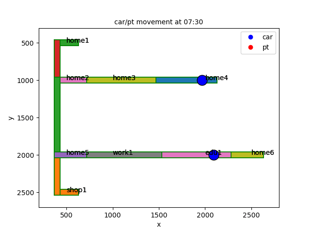
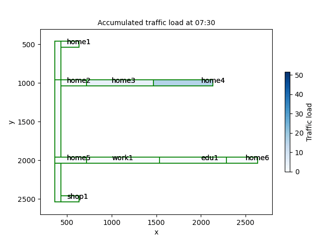

 

**MATSim_VIS** is a package that provides many types of diagnostics from the MatSim model. For example:

- agents movements
- traffic load statistics for links
- travel time 
- mode breakdown statistics (e.g., car, bicyle or public transpotation)
- policy comparisons

The package is written in _python_, and maintained by _zsjzyhzp@gmail.com_

This package is under development please use with cautious.

Documentation can be found [here](https://matsim-vis.readthedocs.io/en/latest/index.html)

