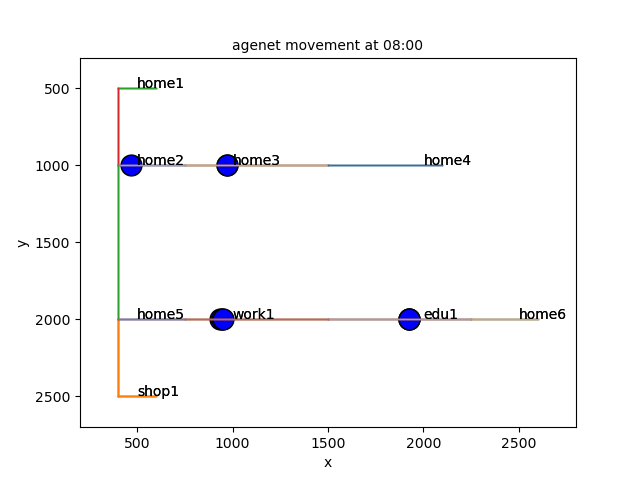

**MATSim_VIS** is a package that provides many types of diagnostics from the MatSim model. For example:

- agents moments
- the trafic load statistics for links
- the agent travel time 
- mode breakdown for each agent (e.g., car, bicyle or public transpotation)
- policy compoarisons

The package is written in _python_, and maintained by _zsjzyhzp@gmail.com_

This package is under development please use it with cautious.

