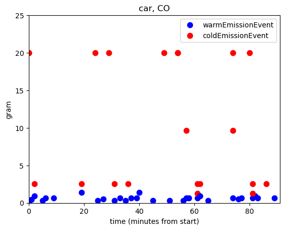
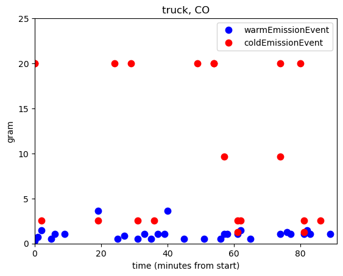
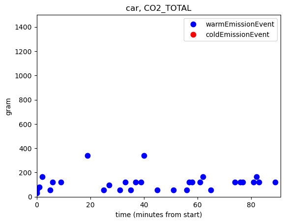
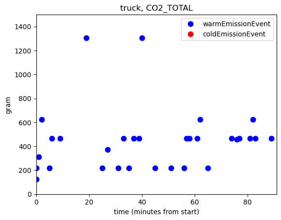

Emission (Petrol car vs Diesel truck)
=====

Assuming that there are two scenarios:

- all agents travel via petrol cars
- all agents travel via diesel trucks

In this section we will compare the emissions between these two scenarios

.. note::

    A few chemicals are included in the MATSim emission extension: CO, CO2, FC, HC, NMHC, NO2, NOX, PM, SO2

From this simple example, we can see that the diesel truck provides more emissions than the car, especailly for a few chemicals such as SO2 and PM