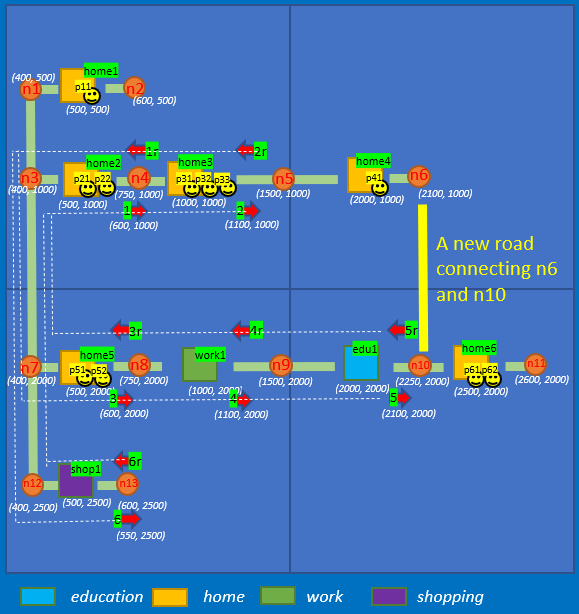
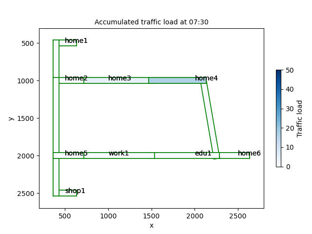
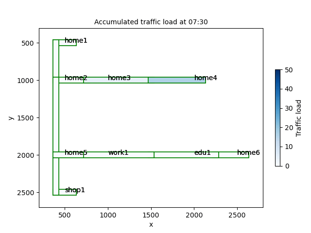

How about a new road
=====

In this example we want to build a road connecting the node 6 and 10, and we would like to
simulate how the traffic flow would change with this road

The new road to be built is shown below:

The accumulated traffic loads differences are shown below:

Of course many other analysis can be done ....