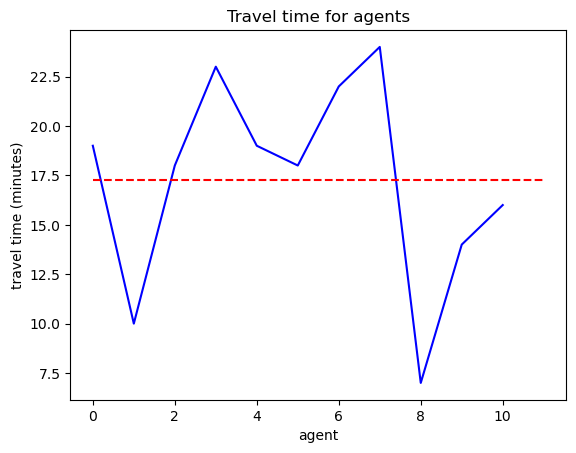
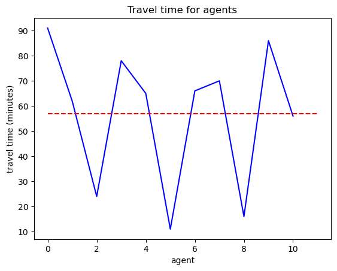

Public transportation
=====

A simple (unrealistic) example is used to show how the village moves with and without public transportation

In MATSim, the following scoring scheme is used (again, it is not realistic ...)

.. code-block:: xml

    <module name="planCalcScore">
        <param name="learningRate" value="1.0" />
        <param name="BrainExpBeta" value="2.0" />
        <param name="lateArrival" value="-18" />
        <param name="earlyDeparture" value="-0" />
        <param name="performing" value="+6" />
        <param name="waiting" value="-1" />

        <parameterset type="modeParams">
            <param name="mode" value="car"/>
            <param name="marginalUtilityOfDistance_util_m" value="-10.0" />
        </parameterset>

        <parameterset type="modeParams">
            <param name="mode" value="walk"/>
            <param name="marginalUtilityOfDistance_util_m" value="5.0" />
        </parameterset>

        <parameterset type="modeParams">
            <param name="mode" value="pt"/>
            <param name="marginalUtilityOfDistance_util_m" value="10.0" />
        </parameterset>

In terms of replanning, the following strategy is used:

.. code-block:: xml

	<module name="strategy">
		<param name="maxAgentPlanMemorySize" value="5" /> <!-- 0 means unlimited -->

		<param name="ModuleProbability_1" value="0.8" />
		<param name="Module_1" value="BestScore" />

		<param name="ModuleProbability_2" value="0.2" />
		<param name="Module_2" value="ChangeTripMode" />

		<param name="ModuleProbability_3" value="0.0" />
		<param name="Module_3" value="TimeAllocationMutator" />

	</module>

See the relevant `transitSchedule <https://github.com/jzanetti/matsim-vis/blob/master/etc/matsim/transitSchedule.xml>`_ 
and `transitVehicles <https://github.com/jzanetti/matsim-vis/blob/master/etc/matsim/transitVehicles.xml>`_ for more details.

.. only:: html

   .. figure:: animation_pt.gif
   .. figure:: animation_without_pt.gif

      The vehicles movements between 07:30:00 and 08:00:00

The codes for generating the movements with both car and pt are shown below:

.. code-block:: python

    from process.agent import (
        get_agent_movement,
        get_all_agents,
        interp_agent_movement,
        select_agents,
    )
    from process.facility import get_facility
    from process.network import get_network
    from process.plans import get_plans
    from process.pt import get_pt
    from process.utils import get_diags_time_range, setup_logging, str2datetime
    from process.vis.movement import plot_movement

    # export PYTHONPATH=/home/szhang/Github/matsim-vis:$PYTHONPATH
    # xml_path = "/home/szhang/Github/matsim-example-project/output/output_events.xml.gz"
    plans_path = "data/example2/output_plans.xml.gz"
    network_path = "data/example2/output_network.xml.gz"
    facility_path = "data/example2/output_facilities.xml.gz"
    transit_path = "data/example2/output_transitSchedule.xml.gz"

    all_links = get_network(network_path)
    pt_movement = get_pt(transit_path, all_links)
    # pt_movement = []
    diags_start_datetime = "07:30:00"
    diags_end_datetime = "08:00:00"

    agents_ratio = 1.0
    logger = setup_logging()
    output_path = "etc/animation_pt.gif"

    diags_start_datetime = str2datetime(diags_start_datetime)
    diags_end_datetime = str2datetime(diags_end_datetime)

    agents = select_agents(get_all_agents(plans_path), agents_ratio)

    logger.info("read all facilities ...")
    all_facilities = get_facility(facility_path)

    logger.info("read all networks ...")
    all_links = get_network(network_path)

    logger.info("obtain time range ...")
    all_times = get_diags_time_range(diags_start_datetime, diags_end_datetime)

    agent_movements = {}
    # get car movements
    for proc_agent in agents:
        all_tasks, _ = get_plans(plans_path, proc_agent)
        agent_movement = get_agent_movement(all_tasks, all_links)
        agent_movements[proc_agent] = interp_agent_movement(agent_movement, all_times)

    pt_index = 0
    pt_movements = {}
    for link_id in pt_movement:
        for depart_id in pt_movement[link_id]:
            pt_movements[pt_index] = interp_agent_movement(pt_movement[link_id][depart_id], all_times)
            pt_index += 1

    plot_movement(agent_movements, pt_movements, all_links, all_facilities, output_path=output_path)

    logger.info("animation is produced")

The total travel time differences are shown below (note that the setup of transit schedule does not reflect the real world situation)

Apparently the total traval minutes increase a lot after most agents choose to talk bus
